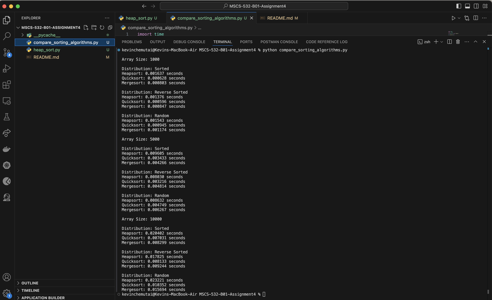

# MSCS-532-B01-Assignment4

Assignment 4: Heap Data Structures: Implementation, Analysis, and Applications

Heapsort Implementation and Analysis

1. Implementation
   Code:
2. Analysis of Implementation

   - Time Complexity:

     - Worse Case: O(nlogn) – Building the heap takes O(n) and each of the n elements is extracted and heapified which is O(logn) for each element.
     - Average Case: O(nlogn) - Heapsort maintains such a structure of the heap, hence it is able to maintain its time complexity as O(nlogn).
       Best Case: O(nlogn) – As every and each element has to be processed, the complexity remains the same.

   - Space Complexity: O(1) – Heapsort is an in-place algorithm hence it takes constant extra space. This is a plus over Merge Sort.

3. Comparison with other sorting algorithms
   Terminal output

   

   Table Summary
   

   Overview of Test Results

   Quicksort Performance: Quicksort is the fastest algorithm for all scenarios, especially in cases when smaller arrays(1000 elements) and cases of sorted and reverse sorted distribution are used. With larger sizes of arrays, this advantage reduces but it keeps the lead over other algorithms in any case.

   Heapsort and Mergesort: Heapsort consistently outperforms mergesort on reverse sorted and sorted distributions but returns higher times on random distributions for larger array size. On the other hand, merge sort is quite similar to heap sort for small arrays but takes a little longer with random distribution as array size is increased.

   Impact of Array Size: The increase of the processing time with the growth in array size is more evident in Mergesort especially for random distribution which might indicate that this algorithm is most sensitive to array size when there is no presorting.

   Sorted vs Random Distributions: All algorithms work better on sorted and reverse-sorted distributions than on random ones with big-size arrays.
